#  Brazil Fire Tracker

An intuitive web application that renders daily maps with geolocation, graphs and lists of fire outbreaks occuring in Brazil.
___

## Introduction

With an area of 8.5 million km², Brazil is composed by six large biomes, including a major portion the Amazon rainforest, which in turn houses the largest biodiversity count on the planet.

Deforestation caused by manmade fires to open land for cattle pastures and soy plantation remains one of the major causes of the Amazon forest's devastation. [According to the Oswaldo Cruz Foundation (Fiocruz) and the Brazilian Institute of Space Research (INPE)](https://portal.fiocruz.br/en/news/climate-change-and-savannization-amazon-will-impact-populations-due-heat), after a certain threshold the forest will begin an irreversible *savannization* process with catastrophic consequences on global climate, risking the survival of millions of people and countless other species.

Several environmental departments in the country struggle to keep long term and serious works, facing political attacks, sabotage and defunding in recent years, making it even more critical that the public understands what is at stake.

 

___

## Table of Contents

<!--ts-->
- [Introduction](#introduction)
- [Video Demo](#video-demo)
- [Features](#features)
- [Distinctiveness and Complexity](#distinctiveness-and-complexity)
  - [Feeding the database through the Admin View](#feeding-the-database-through-the-admin-view)
  - [Rendering the Map](#rendering-the-map)
  - [Clusters / Markers](#clusters--markers)
  - [Info Panel](#info-panel)
  - [Right Menu](#right-menu)
  - [Generating Lists](#generating-lists)
  - [Charts](#charts)
  - [Other Features](#other-features)
- [Project Status](#project-status)
- [Upgrade ideas](#upgrade-ideas)
- [Known bugs and issues](#known-bugs-and-issues)
  - [General](#general)
  - [Mobile](#mobile)
- [Responsiveness, tests and compatibility](#responsiveness-tests-and-compatibility)
- [Tech Stack](#tech-stack)
- [Requirements](#requirements)
- [Installation](#installation)
- [Project Files](#project-files)
  - [/app](#app)
  - [others](#others)
- [Acknowledgements](#acknowledgements)
- [About the Author](#about-the-author)
- [License](#license)
<!--te-->

___

## Video Demo

[Link](https://youtu.be/T-61iMFjbik)

 

🔼 [To table of contents](#table-of-contents)
___

## Features

<li>Intuitive, clean and responsive UI.</li>
<li>Maps of fire outbreak locations for each day, including Google Maps zoom, location naming, clusters and markers views.</li>
<li>List of fire outbreaks with multiple data such as latitude, longitude, satellite collect date, city and state.</li>
<li>Rendering of line, bar and donut(pie) charts for comparison of fire counts between periods of days and months.</li>
<li>Admin view with data collect options to be fed to the database.</li>

 

🔼 [To table of contents](#table-of-contents)

___

## Distinctiveness and Complexity

 

Most of CS50 web's projects applications are structured around the interaction between logged users, such as _mail_, _commerce_, and _network_. So in search of creating a distinct enough project I decided to follow another path.

[INPE](https://queimadas.dgi.inpe.br/queimadas/portal) *(Brazilian Institute of Space Research)* performs a decades long work of obtaining fire outbreaks data from multiple satellites* assisted by the use of their detection algorithms**.

It was a fortunate discovery that as a public department it counts with an open API to provide data on their fires research. Then the idea of taking these data and rendering maps through Google Maps API came to my mind and I found it just too good to let it pass. It would be a project that I would work on with passion.

So I decided to make an application that could benefit from Django's structure to present an intuitive and clean UI for users to access this information. Something that could help on bringing awareness to the amount of fires devastating Brazilian forests.

The application utilizes Django database and backend tools in combination with JavaScript to collect, store and filter data on fire outbreaks' locations, provided by INPE through its API to be displayed to users in multiple ways.

Below I detail how the whole process works.

*This application utilizes solely data from the AQUA_M-T satellite, which is the satellite INPE uses to compose its temporal series of data.

**Q&A on INPE's methodology and other issues are found [here](https://queimadas.dgi.inpe.br/queimadas/portal/informacoes/perguntas-frequentes#p12) (natively in PT-BR as most of our government websites).

 

🔼 [To table of contents](#table-of-contents)
___

### Feeding the database through the Admin View

The admin view was partially customized to harbor the two options available for feeding the database: A link to connect and retrieve it from INPE's API and a file submition input.

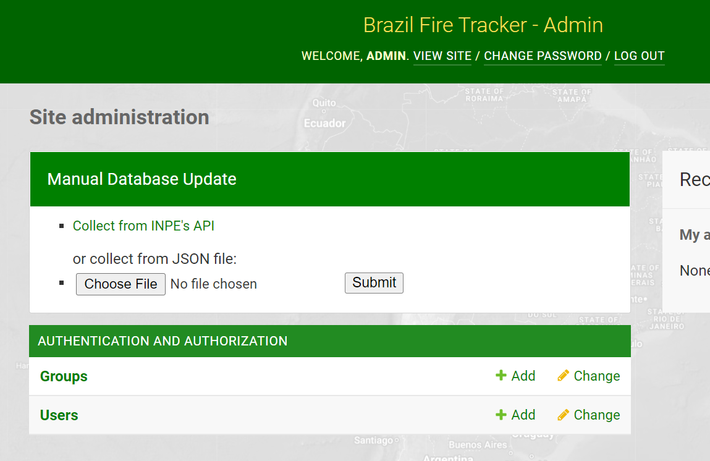

Each option is handled by a different view, both protected by a _@staff_member_required_ decorator.

- **Collect from INPE's API**: Obtains data from the last day directly from INPE's API.

- **File input**: Any data range can be obtained from INPE on [this link](https://queimadas.dgi.inpe.br/queimadas/bdqueimadas#exportar-dados). A link to download the GEOJSON format file will be delivered by e-mail a few minutes after requested.

The data from these two sources come with a few differences in indentation, key names and data syntax, so they are handled in separate views _(api_collect and json_collect)_ before being added to the database.

Dates, latitudes and longitudes have Meta configuration _unique_together_ in the Outbreak model in order to prevent data duplication.

**Error Prevention**

Both views use Django's messages module to catch and report several types of errors such as bad connection to INPE's API or invalid file upload.

 

🔼 [To table of contents](#table-of-contents)
___

### Rendering the Map

A [free trial key for Google Maps API](https://developers.google.com/maps/documentation/javascript/get-api-key)* provided enough time and resources to test and develop this part. For the application to run a key must be obtained and stored in the _app/maps_api_ket.txt_ file. The free trial lasts 3 months.

The application connects to the [Google Maps API Platform](https://developers.google.com/maps) and through JavaScript sets up a custom styled map, centered on Brazil. Through a date input the script fetches from the backend all fire outbreak locations on that date and then renders a marker for each of those locations on the map.

On loading, the map will display data from the most recent available date in the database.

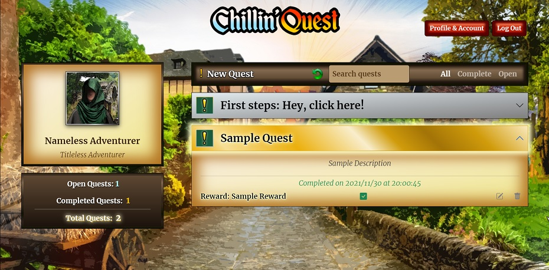

*In a production environment the api key [should be restricted](https://developers.google.com/maps/documentation/javascript/get-api-key#restrict_key) to prevent unauthorized use.

 

🔼 [To table of contents](#table-of-contents)
___

### Clusters / Markers

By default the map view will show clustered markers, which the user can switch for individual markers in the bottom right panel, providing different vizualizations. If toggled for markers, the map script function just won't call the clustering function before rendering the map.

|Clusters|Markers|
|--------|-------|
|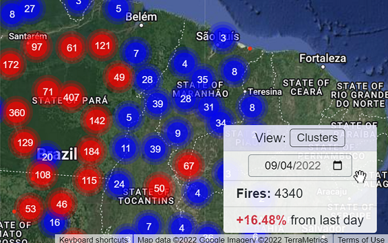|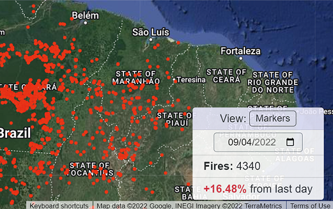|

 

🔼 [To table of contents](#table-of-contents)
___

### Info Panel

The bottom right info panel on the map provides a few functionalities, the first being the just mentioned markers/clusters switch button.

While generating the markers, the script also sums up the amount of fires on the date and displays it to the user.

Lastly, just before rendering the map, the same function in script will connect to another route in the backend to calculate the percentage of change in the fire count from the last day to the current and display it to the user as well.

As much as enabling a meta _index_ does speed up this process, in case the system takes some time to generate the map due to the amount of data a spinner replaces the cluster/markers switch button to provide a hint to the user that their request is being processed, while at the same time preventing subsequent clicks on it, which would genereate too many requests and glitch the counter on their view.

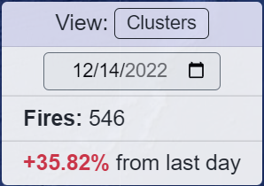

 

🔼 [To table of contents](#table-of-contents)
___

### Right Menu

Accessed by clicking on the top right of the page's "sandwich menu icon", an offcanvas Bootstrap menu will show up presenting links to all the other views of the application and an _about_ section with related external links.

Upon selecting any of the other views, a function will hide the current view and show the selected one, much like in _Project 3: Mail_.

Selecting an already open view displays the map again, as does clicking on the logo on the top left of the page.

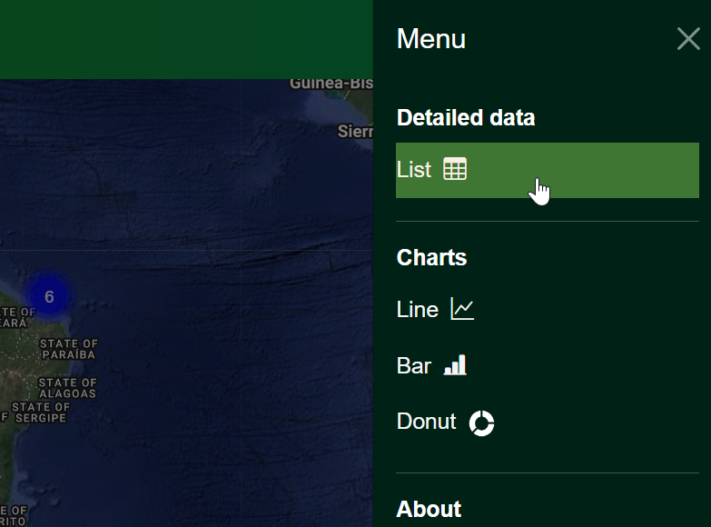

 

🔼 [To table of contents](#table-of-contents)
___

### Generating lists

The information saved in the database can not only be viewed on the map but also displayed on a list (actually a table) containing each fire outbreak's date, latitude, longitude, city and state.

Upon loading the page will proceed to display data from the last available date. If the date input on top of the page is changed it will automatically load the outbreaks' data from the selected date.

The list creator works thought JavaScript by fetching data from the database through another view _(build_list)_ in the backend and procedually generating a table row for each outbreak's data.

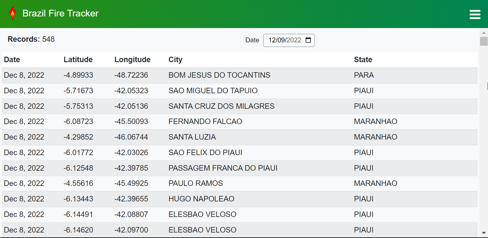

 

Scrolling down the list a JavaScript function will pop up a _Back to Top_ button for some quality of life to the user.

Another feature in this page which as for now only works on desktop is that the table headers will stick to the top upon scrolling. This is yet to be replicated for mobile.

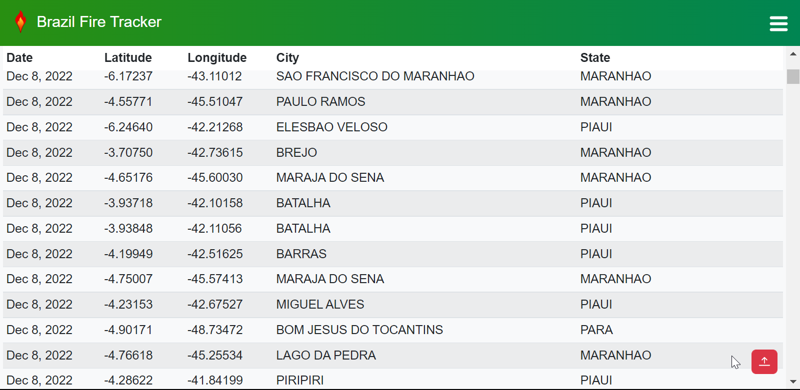

 

🔼 [To table of contents](#table-of-contents)
___

### Charts

While map and list are the options for viewing data from a specific date, the charts are a great way of comparing data through time.

[Plotly](https://plotly.com/) was the tool of choice for this. It's free, easy to use and quite powerful.

Line and Bar charts are optimal to follow change of values through time and are available for comparison of days and months*.

Donut (Pie) charts are better to compare periods as a part of the whole. They become increasingly unreadable as more parts are added, so they were limited to show a total of a month's period.

For this difference Bar and Charts are handled through a function and view _(build_chart)_ while Donut Charts have their own _(build_donut)_.

By selecting dates, the JavaScript function will fetch data which the view will return as a JSON, filtered within the requested period and summing up the fire count of each date.

*Years filtering was left out of the project because the data load of 2022 alone was quite heavy (over 200k records) for my system to test and handle. The addition of years filtering is simple enough to be done in an update by adding another filter and an option to the dropdown menu and date inputs on the frontend.

Line Chart

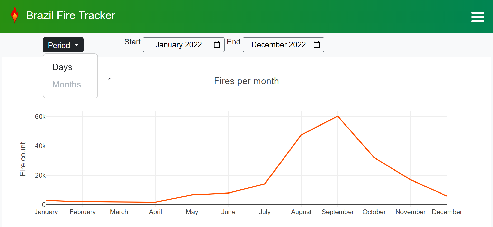

Bar Chart

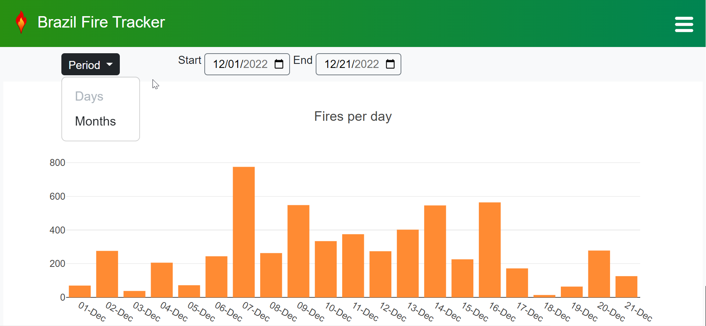

Donut Chart

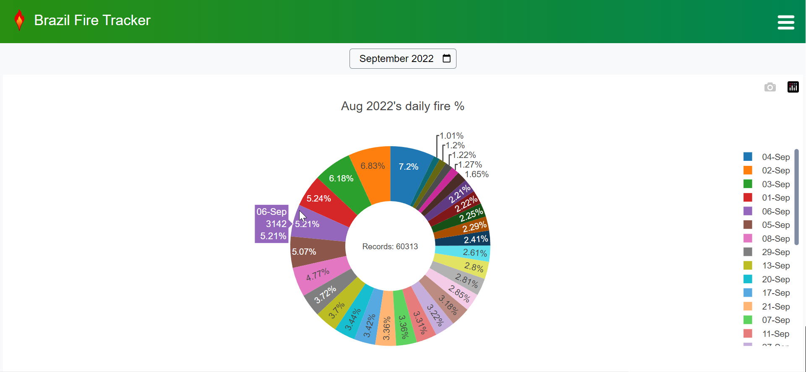

 

🔼 [To table of contents](#table-of-contents)
___

### Other Features

The application has some misuse prevention features as well as it deals with some bugs.

**Date inputs**: Every page that has a date input disables dates where data is unavailable in the database. If a user meddles with the code, the backend will just return no results.

All date inputs submit upon change and date displays count with localization. The UI is also responsive on mobile.

 

🔼 [To table of contents](#table-of-contents)
___

## Project Status

The application is completed for the Final Project. For a production environment however it would probably need a few upgrades. Some ideas are listed in the next section.
___

## Upgrade ideas

The following are upgrades or features I hope to add in future versions. They were scrapped from this version due to current technical limitations such as external requirements or even priority decisions.

**Database**: Switching SQLite3 for PostgreSQL, MySQL or any other more robust database system, depending on the scale in production.

Multiple simultaneous access to the amount of records could get the database locked in SQLite3 (which I eventually managed to do while running some tests).

**Task scheduler for data collect**: A more suitable option to keep the system running in production.

With this option enabled, a local time sensitive counter to show the user when the next data collect would happen would be a nice addition.

**More options for charts**: With a larger amount of data the graphs could be very well employed in comparing periods in two or more lines or two sets of bars and more (e.g.: 2021 months' totals in one line and 2022 in another on the same chart).

**Export list**: An option to export the list into a PDF file.

**A share button**: Especially for the map, which would be a great option for users to engage with the data on social media. This requires that the site is already hosted on an address.

 

🔼 [To table of contents](#table-of-contents)

___

## Known bugs and issues

### General

The following issues happen on mobile views. Despite not being the optimal configuration they do not prevent the application's use.

**Donut chart:**

While touching the list of labels to scroll, Chrome logs:

`[Intervention] Unable to preventDefault inside passive event listener due to target being treated as passive. See https://www.chromestatus.com/feature/5093566007214080`

Despite of the information on the referred link, I still couldn't manage to prevent the logging of this error as it occurs when the action happens inside of a Plotly graph.

**List view:**

The list table headers don't stick to top on scroll.

**Firefox month inputs:**

Are currently replaced by text inputs [as mentioned by Mozilla](https://developer.mozilla.org/en-US/docs/Web/HTML/Element/input/month). They are ugly and not very inutitive but still work.

 

🔼 [To table of contents](#table-of-contents)

___

## Responsiveness, tests and compatibility

The application is responsive on mobile as far as it could be tested on desktop, greatly assisted by Bootstrap classes.

Through all stages of development, mobile views for multiple devices were tested using the developers console in Chrome, Firefox, Opera, Edge and Brave browsers.

Despite a few minor drawbacks in the cases listed above in _known bugs and issues_, the application remained functional through tests.

 

🔼 [To table of contents](#table-of-contents)

___

## Tech Stack

- HTML / CSS
- [Python](https://python.org)
- [JavaScript](https://developer.mozilla.org/pt-BR/docs/Web/JavaScript)
- [Bootstrap](https://getbootstrap.com)
- [SQLite](https://www.sqlite.org/index.html) - through Django's default implementation
- [Django](https://www.djangoproject.com/)
- [Plotly](https://plotly.com/)
- [Google Maps API](https://developers.google.com/maps)

 

🔼 [To table of contents](#table-of-contents)

___

## Requirements

- [Python 3.7+](https://www.python.org/downloads/)
- [Google Maps API KEY](https://developers.google.com/maps/documentation/javascript/get-api-key)
  - Should be pasted in the _app/maps_api_key.txt_ file
  - Google currently (2022) provides a 3 months free trial key
- Google Maps Marker Clusterer: `npm install @googlemaps/markerclusterer`

- Python packages (included in requirements.txt):
  - Django 4.0.1: `pip install Django==4.0.1`
  - requests: `sudo pip3 install requests`

 

🔼 [To table of contents](#table-of-contents)

___

## Installation

**To run local:**

From a terminal in the same folder of manage.py:
1. Install the requirements
2. run `python manage.py createsuperuser` and follow the steps on terminal to create an admin account
3. run `python manage.py runserver`
4. Open the local server address in the terminal on your browser to access the main website
5. To populate the databse as admin, follow the steps in [this section](#feeding-the-database-through-the-admin-view).
     - The database comes with a few months pre-added as a sample.
     - A geojson file with data from several days of December 2022 is also included for testing of the _"collect data from file"_ feature, available in the /admin route.

 

🔼 [To table of contents](#table-of-contents)

___

## Project Files

**Folders and files:**

### /app

- **static**: contains image resources, stylesheet and script.
- **templates**: folder for html files for index, charts(line and bars in chart.html, donut in donut.html), list and map.
- **forms.py**: a single file upload form, made to upload data in the admin view.
- **maps_api_key.txt**: a text file where the Google Maps API key must be pasted in order to run the application.
- **models.py**: contains the Outbreak model, only one used in the project, which handles fire outbreaks data.
- **urls.py**: containing the views routes.
  
### others

**README.assets**: contains images used in this current file.

**static-admin**: contains the css file and admin background image to override the style of the admin view.

**templates-admin**: contains html files that override portions of the admin view.

**README.md**: this current file.

**requirements.txt**: text file containing the python package requirements for installation of the application

**fires_sample.geojson** - a data sample with fire outbreaks data from Dec 1, 2022 to Dec 23, 2022 to be used for testing the Admin _collect from file_ feature

+default Django files

 

🔼 [To table of contents](#table-of-contents)

___

## Acknowledgements

I would like to thank the CS50 staff for another great course, especially Brian Yu for teaching and coordinating CS50 web and I hope the course remains available to those that could benefit from it as much as I did.

My work in this project is dedicated to the following people:

  _[Professor Ricardo Galvão](https://linktr.ee/ricardogalvaosp) for his courage in defending INPE's scientists at the cost of his position as a director._

  _Late [Bruno Pereira and Dom Phillips](https://www.theguardian.com/world/2022/jun/13/dom-phillips-bruno-pereira-brazil-amazon-friendship), who gave their lives in 2022 in defense of the Amazon. May their legacy never be forgotten._

 

🔼 [To table of contents](#table-of-contents)

___

## About the Author

 

 I'm <b>Andrew Mendes</b>, a coding student from Macaé, RJ - Brazil.

 You can find me at:

  

## License

Brazil Fire Tracker is licensed under Apache License 2.0

 

🔼 [To table of contents](#table-of-contents)